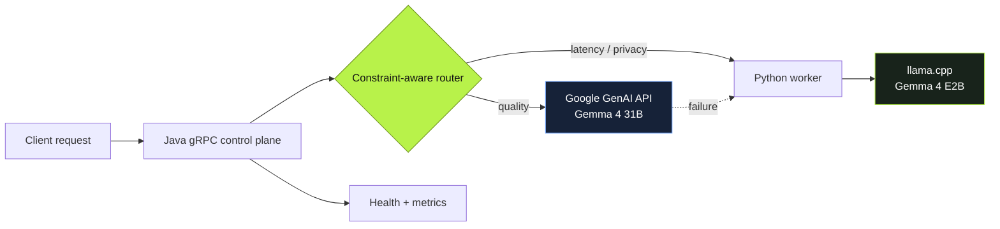
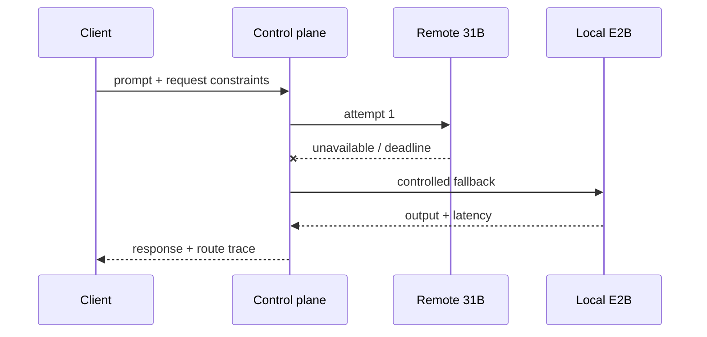

<h1 align="center">CascadeServe</h1>

<p align="center">
  A personal ML systems project exploring how to route Gemma inference between local hardware and hosted APIs under real request constraints.
</p>

<p align="center">
  <a href="https://github.com/giomambre/CascadeServe/actions/workflows/ci.yml"></a>
  
  
  
  
</p>

## Why CascadeServe?

Model selection is a systems decision, not only a prompt-classification problem. CascadeServe builds an ordered execution plan from measured endpoint metadata and the request contract, then handles health, deadlines, retry, and fallback.

- **Local path:** Gemma 4 E2B Q4 on `llama.cpp`, exposed by a narrow Python gRPC worker.
- **Remote path:** Gemma 4 31B through Google's native `generateContent` API.
- **Control plane:** Java owns routing, scheduling, reliability, and Prometheus telemetry.

## Architecture



| Request contract | Expected route | Reason |
|---|---|---|
| No constraints | API 31B | Highest measured quality score |
| `latency_budget_ms=4000` | Local E2B | Remote expected latency exceeds budget |
| `require_local=true` | Local E2B | Prompt cannot leave the device |
| Remote unavailable | Local E2B | Ordered fallback within the deadline |

## Measured results

Same seeded 50-row GSM8K sample, 512-token ceiling:

| Path | Accuracy | p50 | p95 | Route split |
|---|---:|---:|---:|---:|
| Local E2B Q4 | **44%** | **3.08 s** | 3.13 s | 50 local |
| API Gemma 4 31B | **94%** | **6.04 s** | 10.79 s | 50 remote |
| Hybrid policy replay | **70%** | **3.79 s** | 8.87 s | 23 local / 27 remote |

The hybrid row is an **offline replay** of captured local and remote outputs, not a live mixed-load result. A separate calibrated live smoke test verified automatic → 31B and latency/privacy → E2B. Raw outputs, failed experiments, tail latencies, hardware, and limitations are documented in [benchmarks/README.md](benchmarks/README.md).

Additional local serving result: **24.16 req/s at concurrency 8**, with p50/p95/p99 of **328/352/357 ms** for a fixed 16-token workload on an RTX 4070 Laptop GPU.

## Reliability and observability



- Endpoint health checks and dynamic availability
- Deadline-aware retry with bounded attempts
- Per-endpoint circuit breakers and cooldown
- Prometheus `/metrics`, `/healthz`, and `/readyz`
- Response telemetry: endpoint, tier, score, attempts, latency, and API token usage
- **25 Java tests + 34 Python tests**, with simulated remote servers and no cloud credentials in CI

## Quick start

Requirements: Java 17+, Maven 3.9+, Python 3.12, and optionally `llama.cpp` for local Gemma.

```powershell
cd worker
python -m venv .venv
.\.venv\Scripts\Activate.ps1
python -m pip install -e ".[dev]"
python scripts/generate_proto.py
python -m pytest

cd ..\control-plane
mvn test
```

Local-only CI and development require no model download or API key. Docker validation is available with:

```powershell
docker compose up --build
```

<details>
<summary><strong>Run the hybrid Gemma path locally</strong></summary>

Start local Gemma:

```powershell
llama-server -hf google/gemma-4-E2B-it-qat-q4_0-gguf:Q4_0 `
  --host 127.0.0.1 --port 8081 -ngl 99 -c 4096 --jinja --metrics
```

Expose it through the worker:

```powershell
cd worker
.\.venv\Scripts\Activate.ps1
$env:WORKER_ID="gemma-4-e2b"
$env:WORKER_PORT="50052"
$env:MODEL_BACKEND="llama_cpp"
$env:MODEL_ID="google/gemma-4-E2B-it"
$env:MODEL_SERVER_URL="http://127.0.0.1:8081"
python -m cascadeserve_worker.server
```

In a separate terminal, set `GEMINI_API_KEY`, load [config/endpoints.env.example](config/endpoints.env.example), and start `mvn exec:java` from `control-plane/`. Credentials stay in the process environment and are never sent to the demo frontend.

</details>

## Demo

With the worker and control plane running:

```powershell
cd worker
.\.venv\Scripts\Activate.ps1
python scripts/demo.py
```

Open **http://127.0.0.1:8000** and switch between **Quality first**, **Under 4 seconds**, and **Private**. The UI displays the model decision and complete route trace.

## Project map

```text
control-plane/   Java routing, scheduling, reliability, metrics
worker/          Python gRPC worker, evaluation and load tools
proto/           Shared inference contract
demo/            Dependency-free routing UI
benchmarks/      Datasets, raw results and experiment protocol
```

Read the [benchmark methodology](benchmarks/README.md) for experiment details, raw artifacts, and limitations.
